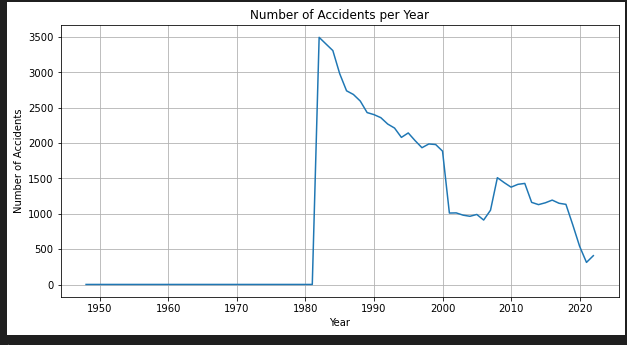
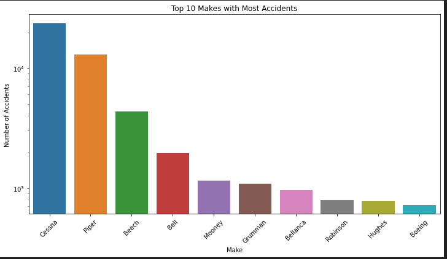
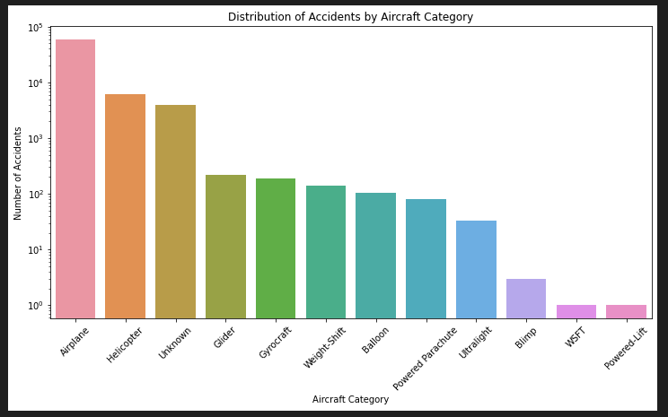

# Data_Aviation_Project

# Overview

This project analyzes aviation data to determine the best model/make of airplane to use in order to reduce the risk of accidents and enhance customer satisfaction.

# Business Understanding

Goal: Identify the safest airplane model/make to minimize accident risk.
Objective: Analyze accident and safety data to recommend the optimal airplane for fleet usage.

## Data Understanding

Sources:
Flight operations data
Accident and safety reports
Airplane model specifications

## Handling Missing Values

Filling with a specific value that is zero fill
Filling with unknown in the broad phase of flight

## Visualizations

### Accident Count Over Time

X-axis: Event.Date
Y-axis: Count of Accidents
Purpose: Distribution of accidents over year.
Type: Line chart

### Accidents by Aircraft Make

X-axis: Make
Y-axis: Count of Accidents
Purpose: Show top 10  makes that have the most accidents.
Type: Bar chart.

### Accidents by Aircraft Category

X-axis: Aircraft.Category
Y-axis: Count of Accidents
Purpose: Distribution of accidents by category.
Type: Bar chart

## Data Analysis

Methods:
Descriptive statistics
Safety incident analysis
Correlation analysis between airplane models and accident rates

## Recommendations

Best Airplane Model: Based on analysis, recommend the safest airplane model/make.
Safety Enhancements: Suggest additional safety measures for the recommended model.

For any questions or further information, please contact:

- **Project Lead**: [MULI LILIAN MWIKALI]
- **Email**: [mulililian2017@gmail.com]
- **GitHub**: [https://github.com/mwikali24/Data_Aviation_Project]
- **Tableau**: [https://public.tableau.com/app/profile/lilian.muli6745/viz/Tableauproject_17184007387160/AVIATIONTRENDSDASHBOARD]